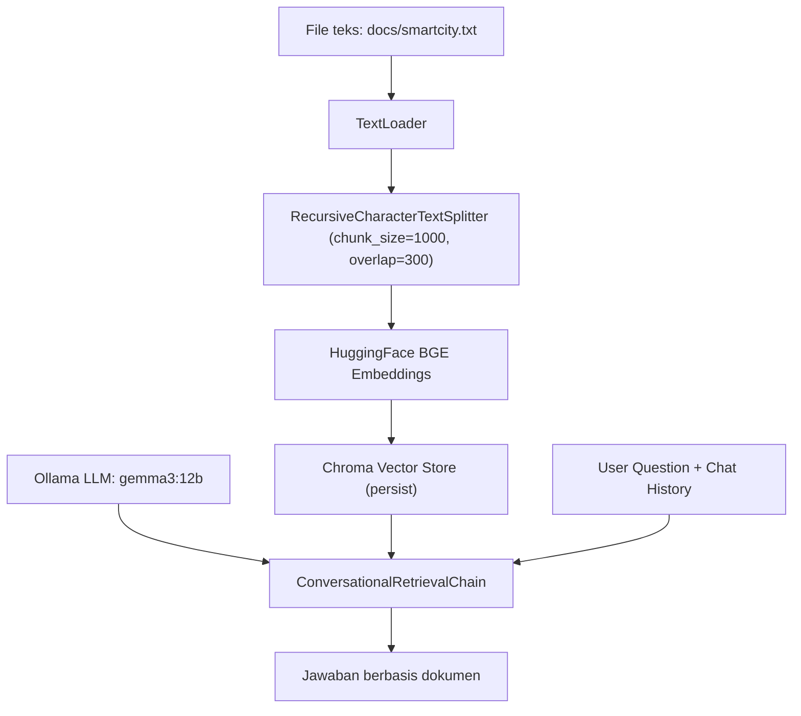

#  RAG Chat – LangChain + Chroma + BGE + Ollama (Gemma 3)

Bangun **chatbot RAG** (Retrieval-Augmented Generation) yang hanya menjawab berdasarkan isi dokumen lokal Anda.
Proyek ini memuat file teks, memotongnya jadi potongan (chunks), membuat **embedding** dengan **BGE**, menyimpannya ke **Chroma**, lalu melakukan tanya-jawab memakai **LLM lokal via Ollama** (contoh: `gemma3:12b`).

---

##  Fitur

*  **Conversational Retrieval**: menjaga konteks percakapan dengan `chat_history`.
*  **Akurasi lebih baik**: jawaban dibatasi pada isi dokumen (anti “ngarang”).
*  **Persisten**: vektor disimpan ke folder `./chroma_db`.
*  **Mudah ganti model**: ubah embedding (BGE) atau LLM (Ollama) sesuai kebutuhan.
*  **Sederhana dijalankan**: satu file Python, jalankan & tanya!

---

##  Arsitektur (RAG alur sederhana)



---

##  Struktur Direktori (disarankan)

```
.
├─ docs/
│  └─ smartcity.txt       # dokumen sumber Anda
├─ chroma_db/             # akan dibuat otomatis (persist)
├─ rag_chat.py            # skrip utama (isi seperti di bawah)
└─ README.md
```

> Pastikan file **`docs/smartcity.txt`** ada.

---

##  Prasyarat

1. **Python 3.10+** dan **pip**

2. **Ollama** terpasang & model diunduh

   * Instal: [https://ollama.com](https://ollama.com)
   * Tarik model (contoh Gemma 3 12B):

     ```bash
     ollama pull gemma3:12b
     ```
   * Jalankan daemon Ollama (biasanya otomatis saat pertama kali dipakai).

3. **Dependensi Python**
   Buat *virtual environment* (opsional tapi disarankan):

   ```bash
   python -m venv .venv
   # Linux/macOS
   source .venv/bin/activate
   # Windows (PowerShell)
   .\.venv\Scripts\Activate.ps1
   ```

   Instal paket:

   ```bash
   pip install -U pip
   pip install langchain langchain-community langchain-ollama chromadb \
               sentence-transformers transformers tqdm pandas
   ```

> **Catatan:** Paket `HuggingFaceBgeEmbeddings` memanfaatkan `sentence-transformers`. Unduhan model BGE akan otomatis saat pertama run (butuh koneksi internet pertama kali).

---


##  Menjalankan

1. Pastikan **Ollama** aktif dan model sudah ditarik.
2. Pastikan file **`docs/smartcity.txt`** tersedia.
3. Jalankan:

   ```bash
   python rag_chat.py
   ```
4. Tanyakan sesuatu:

   ```
   ❓ Pertanyaan kamu: Apa definisi smart city pada dokumen ini?
   🤖 Jawaban: ...
   ```

Ketik `exit` untuk keluar.

---

##  Mengganti Model

### Mengganti **LLM** (Ollama)

* Ubah baris:

  ```python
  llm = OllamaLLM(model="gemma3:12b")
  ```

  Contoh opsi lain (jika tersedia di Ollama):

  * `llama3.1:8b-instruct`
  * `qwen2.5:7b-instruct`
  * `mistral:7b-instruct`

> Pastikan Anda sudah `ollama pull <nama-model>`.

### Mengganti **Embedding**

* Baris bawaan:

  ```python
  model_name="BAAI/bge-small-en-v1.5"
  ```
* Alternatif:

  * **Multibahasa**: `BAAI/bge-m3`
  * **Lebih besar/akurat**: `BAAI/bge-base-en-v1.5` (lebih berat)
  * **Bahasa Indonesia (opsi komunitas)**: bisa gunakan model Indo di Hugging Face yang kompatibel dengan `sentence-transformers`.

> Setelah mengganti model embedding, **hapus** folder `./chroma_db` agar indeks dibuat ulang:

```bash
rm -rf chroma_db
```

---

##  Tips & Praktik Baik

* **Kualitas dokumen**: bersihkan teks (hapus header/footer berulang, tanda baca aneh).
* **Ukuran chunk**:

  * `chunk_size=1000`, `chunk_overlap=300` cocok untuk paragraf panjang.
  * Coba variasi untuk performa & relevansi (misal 800/200).
* **Jumlah dokumen**: makin banyak → waktu embed awal lebih lama, tapi pencarian makin kaya.
* **Privasi**: semua dokumen & vektor disimpan lokal (selama Anda pakai LLM lokal via Ollama).

---

##  FAQ

**Q: “Jawabannya kosong atau ngawur.”**
A:

* Pastikan pertanyaan memang ada di dokumen.
* Coba model embedding **multibahasa** jika dokumen campur Indo/Inggris (`BAAI/bge-m3`).
* Perkecil `chunk_size` agar potongan lebih spesifik.

**Q: “Ollama error / model tidak ditemukan.”**
A:

* Pastikan daemon berjalan dan model sudah di-pull:

  ```bash
  ollama pull gemma3:12b
  ollama run gemma3:12b  # tes cepat
  ```

**Q: “Ingin reset index Chroma.”**
A:

```bash
rm -rf chroma_db
```

Jalankan ulang skrip untuk membangun indeks baru.

---

##  Contoh Pertanyaan

* “Sebutkan pilar smart city yang disebut dalam dokumen ini.”
* “Apa rekomendasi arsitektur data untuk layanan perizinan?”
* “Ada definisi IoT di dokumen ini tidak?”

---

##  Lisensi

MIT — bebas digunakan untuk keperluan pribadi maupun komersial, tetaplah menyertakan atribusi.

---

##  Kredit

* [LangChain](https://python.langchain.com/)
* [ChromaDB](https://www.trychroma.com/)
* [BAAI BGE Embeddings](https://huggingface.co/BAAI)
* [Ollama](https://ollama.com/)

---

##  Catatan Teknis (Opsional)

* **normalize_embeddings=True** penting untuk stabilitas kesamaan kosinus pada BGE.
* `ConversationalRetrievalChain` memanfaatkan `chat_history` (list pasangan Q–A) agar konteks percakapan berlanjut.
* Prompt sudah melarang halusinasi: jika tidak ada di dokumen → “Saya tidak tahu berdasarkan dokumen yang ada.”

---


