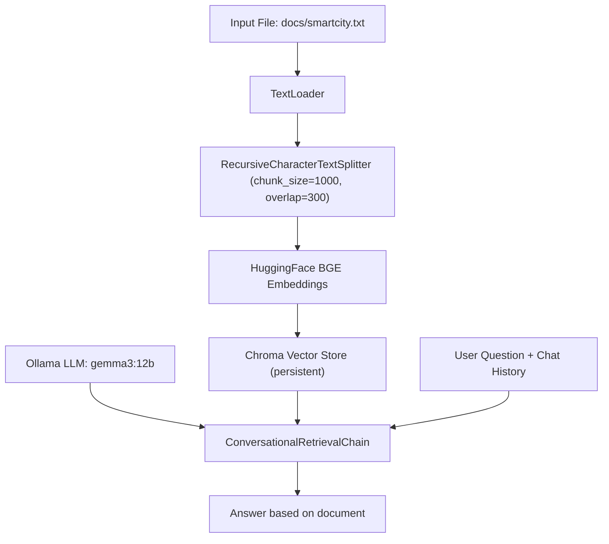

# RAG Chat – LangChain + Chroma + BGE + Ollama (Gemma 3)

Build a **Retrieval-Augmented Generation (RAG)** chatbot that only answers based on the contents of your local document.
This project loads a text file, splits it into chunks, creates **embeddings** using **BGE**, stores them in **Chroma**, and performs Q&A using a **local LLM via Ollama** (example: `gemma3:12b`).

---

## Features

*  **Conversational Retrieval**: maintains chat history for contextual responses.
*  **Fact-based answers**: responses are strictly grounded in the document (no hallucinations).
*  **Persistent storage**: embeddings saved in `./chroma_db`.
*  **Modular setup**: easily swap embeddings or LLM models.
*  **Simple to run**: one Python file, ready for Q&A.

---

##  Architecture Overview



---

##  Recommended Folder Structure

```
.
├─ docs/
│  └─ smartcity.txt       # your source document
├─ chroma_db/             # auto-created for persistent vectors
├─ rag_chat.py            # main script (code below)
└─ README.md
```

> Make sure the file **`docs/smartcity.txt`** exists.

---

##  Requirements

1. **Python 3.10+**

2. **Ollama** installed and model downloaded

   * Install Ollama → [https://ollama.com](https://ollama.com)
   * Pull the Gemma model:

     ```bash
     ollama pull gemma3:12b
     ```
   * The Ollama daemon must be running (usually automatic on first use).

3. **Python Dependencies**
   (recommended: use a virtual environment)

   ```bash
   python -m venv .venv
   source .venv/bin/activate     # macOS/Linux
   .\.venv\Scripts\Activate.ps1  # Windows PowerShell
   ```

   Install packages:

   ```bash
   pip install -U pip
   pip install langchain langchain-community langchain-ollama chromadb \
               sentence-transformers transformers tqdm pandas
   ```

> **Note:** The `HuggingFaceBgeEmbeddings` class will automatically download the embedding model (requires internet access the first time).

---


##  How to Run

1. Make sure **Ollama** is active and the model is ready.
2. Ensure `docs/smartcity.txt` is present.
3. Run:

   ```bash
   python rag_chat.py
   ```
4. Ask a question:

   ```
   ❓ Your question: What is the definition of smart city in this document?
   🤖 Answer: ...
   ```

Type `exit` to quit.

---

##  Changing Models

###  Changing the LLM (Ollama)

```python
llm = OllamaLLM(model="gemma3:12b")
```

Try:

* `llama3.1:8b-instruct`
* `qwen2.5:7b-instruct`
* `mistral:7b-instruct`

Make sure to pull first:

```bash
ollama pull llama3.1:8b-instruct
```

###  Changing the Embedding Model

```python
model_name="BAAI/bge-small-en-v1.5"
```

Alternatives:

* `BAAI/bge-m3` (multilingual)
* `BAAI/bge-base-en-v1.5` (larger, more accurate)
* Indonesian-compatible embeddings (community models on Hugging Face)

> After changing embeddings, rebuild the database:

```bash
rm -rf chroma_db
```

---

##  Best Practices

* **Clean your documents**: remove repeated headers, footers, and artifacts.
* **Tune chunk sizes** for balance between context and performance.
* **Local-first privacy**: all data and vectors stay on your machine.

---

##  FAQ

**Q: The model gives irrelevant or empty answers.**
A:

* Check if your question exists in the document.
* Try multilingual embeddings if using mixed languages.
* Reduce `chunk_size` for finer-grained retrieval.

**Q: Ollama error / model not found.**
A:

```bash
ollama pull gemma3:12b
ollama run gemma3:12b  # test if it runs
```

**Q: Rebuild Chroma index.**
A:

```bash
rm -rf chroma_db
```

---

##  Example Prompts

* “List the smart city pillars mentioned in the document.”
* “What are the recommended data architecture components?”
* “Is there a definition of IoT in the text?”

---

##  License

MIT License — free for personal and commercial use (please retain attribution).

---

##  Credits

* [LangChain](https://python.langchain.com/)
* [ChromaDB](https://www.trychroma.com/)
* [BAAI BGE Embeddings](https://huggingface.co/BAAI)
* [Ollama](https://ollama.com/)

---

## 🔍 Technical Notes

* `normalize_embeddings=True` ensures stable cosine similarity in BGE.
* `ConversationalRetrievalChain` preserves chat context through `chat_history`.
* The custom prompt ensures factual, document-grounded answers.

---

